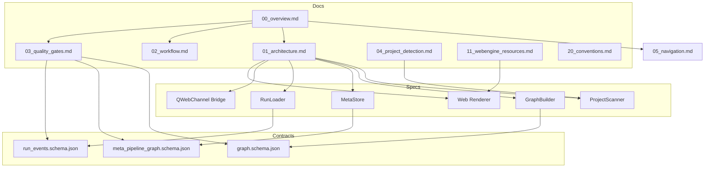

# Graph Map（图示：Doc ↔ Spec ↔ Contract）

## A) 关系图（概念层）

## B) 最小演示（GUI 的默认图建议）
- Docs：用 `docs_link` 连线（从 md 链接解析）
- Module ↔ Contract：用 `produces/consumes`（来自 spec IO 或 meta/pipeline_graph.json）
- Phase 分组：用 meta.modules.phase；缺失统一放 `Unassigned`
